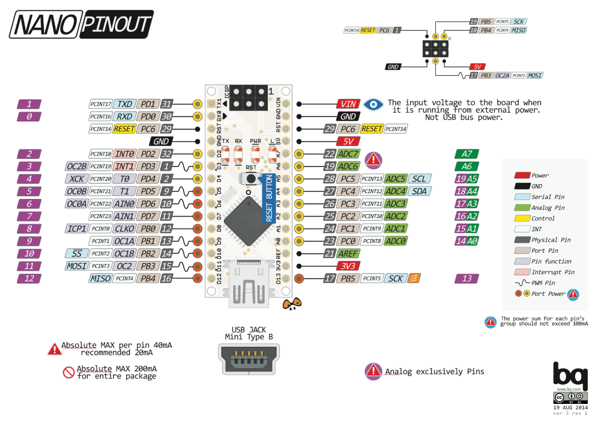
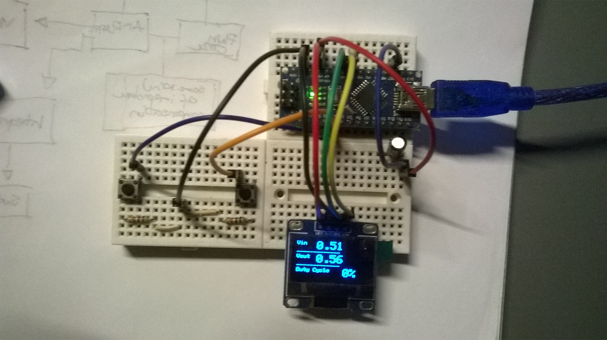

# Arduino Nano Practice - Lab Power Supply (PC controlled)

In this project i attempt to create PC controlled, Arduino Nano based lab power supply.

Resources for learning:

[AVR-C You Tube](https://www.youtube.com/watch?v=9ADxPRjZI4Q&list=PLA6BB228B08B03EDD)

[Beginners Guide](https://www.researchgate.net/publication/263084656_A_Beginners_Guide_to_AVR)

[ATmega328P_Datasheet](./pdf/ATmega328P_Datasheet.pdf)

Parts needed:

* Arduino Nano
* 2x Button
* 2x 1kΩ resistor
* 1x 2.2μF 50V (in my case, any in range 1μF-4.7μF and 10V-50V is good enough)
* 1x OLED (Oak type) display (optional)

PWM runs at 62 500hz
